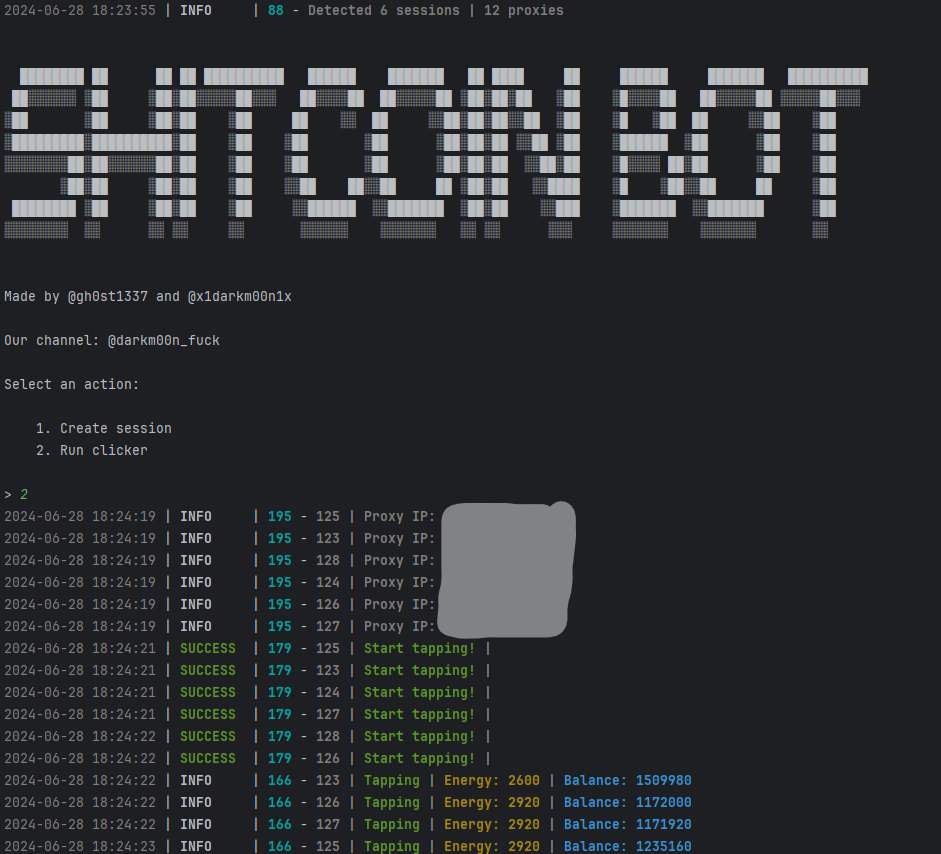

[](https://t.me/gh0st1337)



> 🇷🇺 README на русском доступен [здесь](README.md)

## Features  
| Feature                                                          | Supported      |
|------------------------------------------------------------------|:--------------:|
| Multithreading                                                   |       ✅        |
| Proxy binding to session                                         |       ✅        |
| Random sleep time between clicks                                 |       ✅        |
| Random number of clicks per request                              |       ✅        |
| Support for tdata / pyrogram .session                            |       ✅        |


## [Settings](https://github.com/DARKM00N1337/ShitCoinTapBot/blob/main/.env-example)
| Setting                         | Description                                                               |
|---------------------------------|---------------------------------------------------------------------------|
| **API_ID / API_HASH**           | Data of the platform to launch the Telegram session (default - Android)   |
| **SLEEP_BETWEEN_TAP**           | Sleep time between a series of clicks (e.g., 10, 25)                     |
| **CLICKS_FOR_SLEEP**            | Number of clicks before sleep (e.g., 100, 150)                           |
| **LONG_SLEEP_BETWEEN_TAP**      | Sleep time for energy accumulation (e.g., 6000, 7000)                    |
| **SLEEP_BY_MIN_ENERGY_IN_RANGE**| Amount of energy at which the bot will go for a long sleep (e.g., 300, 350)|
| **SHOW_BALANCE_EVERY_TAPS**     | How often to show balance and energy (e.g., 20)                 |
| **USE_PROXY_FROM_FILE**         | Whether to use proxies from `bot/config/proxies.txt` file (True / False) |


## Installation
You can download the [**Repository**](https://github.com/DARKM00N1337/ShitCoinTapBot) by cloning it to your system and installing the necessary dependencies:
```shell
~ >>> git clone https://github.com/DARKM00N1337/ShitCoinTapBot.git 
~ >>> cd ShitCoinTapBot

# Linux
~/ShitCoinTapBot >>> python3 -m venv venv
~/ShitCoinTapBot >>> source venv/bin/activate
~/ShitCoinTapBot >>> pip3 install -r requirements.txt
~/ShitCoinTapBot >>> cp .env-example .env
~/ShitCoinTapBot >>> nano .env  # You must specify your API_ID and API_HASH here, the rest is taken by default
~/ShitCoinTapBot >>> python3 main.py

# Windows
~/ShitCoinTapBot >>> python -m venv venv
~/ShitCoinTapBot >>> venv\Scripts\activate
~/ShitCoinTapBot >>> pip install -r requirements.txt
~/ShitCoinTapBot >>> copy .env-example .env
~/ShitCoinTapBot >>> # Specify your API_ID and API_HASH, the rest is taken by default
~/ShitCoinTapBot >>> python main.py
```

You can also use arguments for quick start, for example:
```shell
~/ShitCoinTapBot >>> python3 main.py --action (1/2)
# Or
~/ShitCoinTapBot >>> python3 main.py -a (1/2)

# 1 - Creates a session
# 2 - Starts the clicker

```